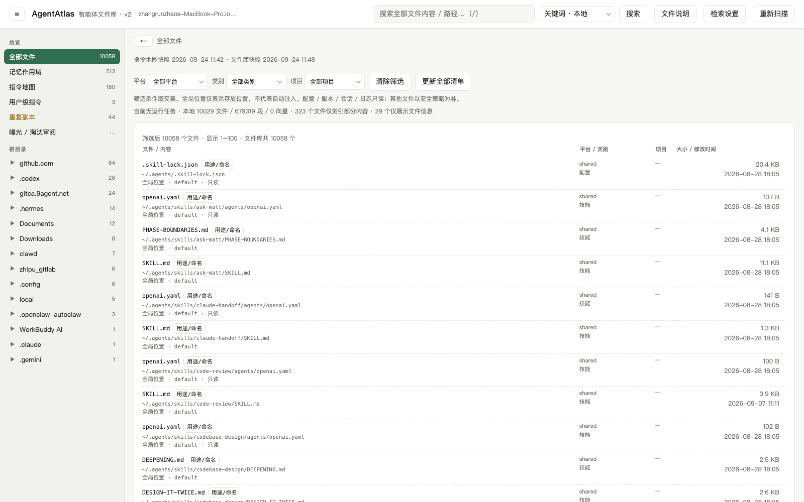

# AgentAtlas

[](https://www.python.org/)
[](atlas/)
[](web/index.html)

智能体运行时文件的本地地图集 —— 把散落在各工具目录里的 AGENTS.md / CLAUDE.md、记忆、技能、命令、会话和日志，统一扫描成一张可导航、可检索、可审阅的地图，并区分文件**所在位置**、**设计用途**与**实际生效方式**。

> The local-first atlas for AI agent runtime files: instructions, memories, skills, sessions — mapped, searched and reviewed across agent tools.



## 为什么

智能体工具越装越多，指令和记忆文件也越散越乱：同一份 AGENTS.md 在 N 个仓库里各有一份漂移的副本；记忆文件写在哪、被谁读、管多大范围，各平台规则都不同。AgentAtlas 在本机把这些文件扫成一张图：

- 指令文件按 **根目录 → 项目 → 子目录** 分级展示，相同内容的副本按哈希归组；
- 记忆文件按**已核对的作用域规则**展示（适用项目 / Profile / 读取者 / 触发条件），不把「存放目录」冒充「生效范围」；
- 会话日志与生效栈做交叉统计，给出指令文件的**推算曝光**与**淘汰审阅**线索。

本地优先：扫描、关键词检索、编辑全部离线；可选的云端功能（语义检索、翻译）逐次确认发送范围。

## 功能

- **限定范围扫描**：在指定根目录和深度内发现智能体文件，排除凭证、缓存、生成物；重复副本按哈希归组
- **层级地图**：根目录 → 项目 → 子目录三级树，每级显示文件数、重复数、总字节、最近修改时间
- **全部文件库**：平台 × 用途 × 项目三维筛选；指令、记忆、技能、参考、命令、钩子、配置、会话、日志统一入库
- **记忆作用域**：按已核实的读取规则展示作用层级、适用项目/Profile、读取者与条件；可切换「按存放目录」浏览
- **文件说明**：每个文件类型给出路径约定、用途、生成/读取角色、命名拆解与来源；说明库独立于代码，可热刷新
- **正文检索**：本地关键词全文检索（带路径与行号）；可配置 `/embeddings` 兼容服务做语义/混合检索，向量存本机 SQLite
- **浏览与编辑**：查看原文、单 section 保存；写盘前自动备份，SHA-256 冲突检测，大文件截断保护
- **曝光与淘汰审阅**：会话日志 × 生效栈推算指令曝光，审阅决定绑定内容版本；只记录决定，不动原文件
- **可选 LLM 翻译**：对可编辑文件调用配置的云端模型翻译，译文哈希缓存

## 覆盖的文件类型

| 文件 | 归属工具 |
|---|---|
| `AGENTS.md` | Codex / 通用标准 |
| `CLAUDE.md` | Claude Code |
| `GEMINI.md` | Gemini CLI |
| `QWEN.md` | Qwen Code |
| `.cursorrules` | Cursor（旧） |
| `.cursor/rules/*.mdc` | Cursor（新） |
| `.windsurfrules` | Windsurf |
| `.clinerules` | Cline |
| `.github/copilot-instructions.md` | GitHub Copilot |

文件库的范围不止指令：各平台的状态目录（`~/.claude`、`~/.codex`、记忆/技能/命令/钩子/会话/日志等）经 `atlas/platforms/` 注册表白名单纳入。

## 快速开始

```bash
git clone https://github.com/<user>/agentAtlas.git
cd agentAtlas

# 1. 按需编辑扫描范围（默认已包含 Code、.claude、.codex 等常用目录）
$EDITOR atlas/scan.py   # 修改 ROOTS

# 2. 扫描（或启动后点「重新扫描」）
python3 atlas/scan.py

# 3. 启动服务
python3 atlas/serve.py
# 打开 http://127.0.0.1:7788
```

要求：Python 3.9+（`atlas/eval/` 用了内置泛型语法），零第三方依赖，无构建步骤。

使用须知：

- 后端**不热重载**：修改 `atlas/` 下 Python 代码后需重启 `serve.py`；`web/` 与 `docs/` 静态文件刷新页面即生效
- 服务固定监听 `127.0.0.1:7788`，验证时确认浏览器实际打开的地址
- 不要让两个长期运行的实例共用同一个 `.agentatlas/`（各自缓存清单与任务状态，索引任务不跨进程协调）

## 平台注册表（新增平台 = 加一个目录）

平台目录、裁剪规则、类别提示与记忆作用域规则集中在 `atlas/platforms/`：每个平台一个子包，在 `__init__.py` 里声明 `PLATFORM = Platform(...)`，注册表启动时自动发现。新增平台不改任何现有模块：

1. 新建 `atlas/platforms/<name>/__init__.py`，声明 `Platform(id=..., user_roots=(...), ...)`；
2. 已核对官方读取规则的，再实现 `resolve_memory(ctx)`（参考 `claude/`、`codex/`、`hermes/`、`openclaw/`）；规则未核实的保持缺省，界面按「未知」诚实展示；
3. 需要进入指令地图的目录设 `instruction_scan=True`（含 `scan_roots`），仅入文件库的用 `user_roots`。

已登记 17 个平台：claude、codex、hermes、gemini、cursor、windsurf、qwen、cline、roo、continue、opencode、copilot、shared、openclaw、workbuddy、zcode、skilltools。

## 结构

```
agentAtlas/
├── atlas/
│   ├── scan.py           # 扫描器：发现、去重、分级 → atlas.json
│   ├── serve.py          # 本地服务：静态页 + REST API（仅标准库）
│   ├── catalog.py        # 平台资产目录与项目身份判定
│   ├── platforms/        # 平台注册表：一平台一子包，自动发现
│   ├── memory_scope.py   # 记忆作用域规则解析
│   ├── memory_metadata.py / memory_storage.py
│   ├── search_index.py   # 关键词与向量检索索引
│   ├── sections.py       # Markdown section 解析与单组件保存
│   ├── storage.py        # 安全清单与文件访问控制
│   ├── lifecycle.py      # 备份、审阅决定、编辑日志
│   ├── provenance.py     # 文件说明（provenance）服务
│   ├── usage.py          # 曝光统计（会话日志 × 生效栈）
│   ├── retirement.py     # 淘汰审阅
│   └── eval/             # 评测脚手架（数据集 / 运行器 / 评分器 / 隔离）
├── web/
│   ├── index.html        # 单页界面（原生 HTML/CSS/JS）
│   └── lifecycle.js
├── docs/                 # file-types.json、设计文档、规则文档
├── tests/                # unittest + node:test + CDP 浏览器测试
└── atlas.json            # 扫描产物（.gitignore，首次扫描生成）
```

## 隐私与安全

- **默认完全本地**：扫描、关键词检索、浏览编辑不联网
- 密钥与凭证路径在扫描时排除；配置文件中的敏感内容另行检查（检测不能替代人工审查）
- 编辑安全：保存前自动备份到 `.agentatlas/lifecycle/backups/`，需携带打开时的 SHA-256，源文件被外部修改则返回冲突；截断预览禁止保存
- 云端功能（语义检索、翻译）**逐次确认发送范围**：会话、日志、配置默认不在发送范围；任务进行中改设置会即时撤销授权；API Key 存 `.agentatlas/embedding-key`（权限 `0600`），不回传浏览器
- 只读类别（会话、日志、配置、平台内部数据库）不开放编辑
- `.agentatlas/`（正文索引、向量、设置、备份）与 `atlas.json` 已列入 `.gitignore`，不要上传或分享

## 测试

```bash
# 单元与逻辑测试
python3 -m unittest discover -s tests -v
node --test tests/lifecycle.test.cjs

# 真实浏览器测试（需独立 headless Chrome + CDP）
export CDP_PORT=<调试端口> ATLAS_URL=http://127.0.0.1:7788
node tests/browser_file_guide.mjs && node tests/browser_memory_storage.mjs && node tests/browser_navigation.mjs
```

注：macOS 开系统代理时，给 unittest 加 `no_proxy='*'`，否则同源自检会被代理拦截产生假失败；若隔离类测试因解释器白名单失败，改用系统 Python（`/usr/bin/python3`）。自动化 embedding 测试使用本地测试服务，不消耗云端额度。

## 文档

| 文档 | 内容 |
|---|---|
| [docs/file-types.json](docs/file-types.json) | 文件类型/命名说明库（唯一内容源，界面可热刷新） |
| [docs/agent-file-design.md](docs/agent-file-design.md) | 文件设计模型、命名与显示标题的区别、说明库维护流程 |
| [docs/memory-rules.md](docs/memory-rules.md) | 记忆作用域与读取规则的保守解释 |
| [docs/logic-review.md](docs/logic-review.md) | 逻辑审查与修复记录 |
| [docs/provenance-research.md](docs/provenance-research.md) | 溯源机制调研 |

## Roadmap

- [ ] Tauri 桌面壳
- [ ] GEPA 式自动优化：真实评测集 + 隔离运行环境 + 预算确认（`atlas/eval/` 已有脚手架）
- [ ] 更多平台的记忆作用域规则核实与登记

## License

TBD
